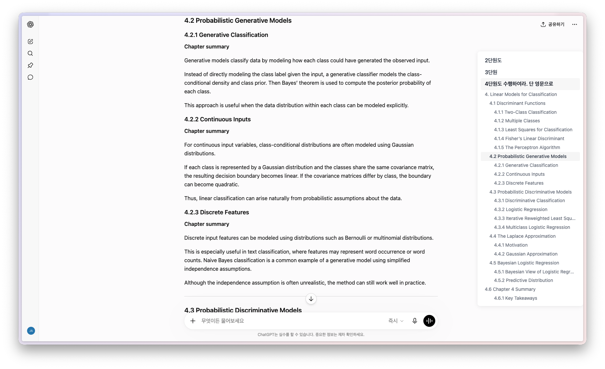

# AutoToC

[ [English](https://github.com/jaewonE/AutoToC) | [한국어](https://github.com/jaewonE/AutoToC/blob/main/README.ko.md) ]

AutoToC는 `chatgpt.com`에서 현재 활성화된 답변의 heading 마커를 화면 오른쪽 사이드바에 표시하는 Chrome 확장 프로그램입니다.

* 각 heading 마커를 클릭하면 해당 header가 있는 위치로 스크롤을 이동할 수 있습니다.
* ChatGPT는 스크롤 위치에 따라 대화를 동적으로 불러옵니다. 한 번 로드된 대화는 캐싱되어 기억되지만, 아직 로드되지 않은 대화의 heading은 사이드바에 표시되지 않을 수 있습니다.
* 답변의 header 개수가 너무 많거나 각 header 사이의 간격이 지나치게 촘촘한 경우, 개별 heading 아이콘 대신 단일 아이콘으로 대체될 수 있습니다.

## 설치

AutoToC는 현재 unpacked local extension 형태로 사용합니다.

1. 이 repository를 clone합니다.
2. `chrome://extensions`를 엽니다.
3. **Developer mode**를 켭니다.
4. **Load unpacked**를 클릭합니다.
5. 이 repository 폴더를 선택합니다.
6. `https://chatgpt.com/`을 열거나 새로고침합니다.

별도의 build step은 필요하지 않습니다. Chrome이 `manifest.json`, `content/content.js`, `content/content.css`를 직접 로드합니다.

## 라이선스

이 프로젝트는 GNU General Public License v3.0에 따라 배포됩니다. 자세한 내용은 [LICENSE](LICENSE) 파일을 참고하세요.
